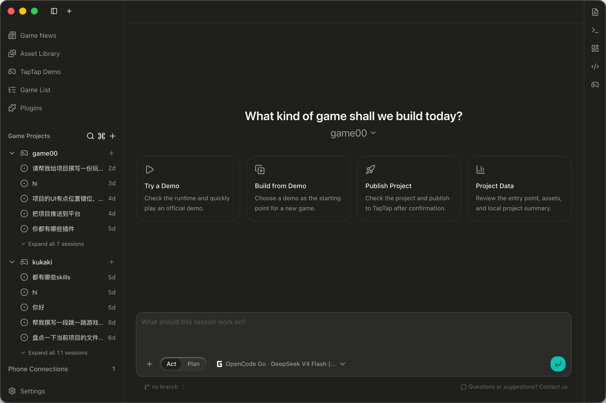
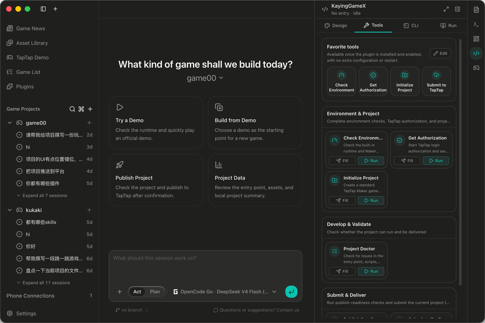
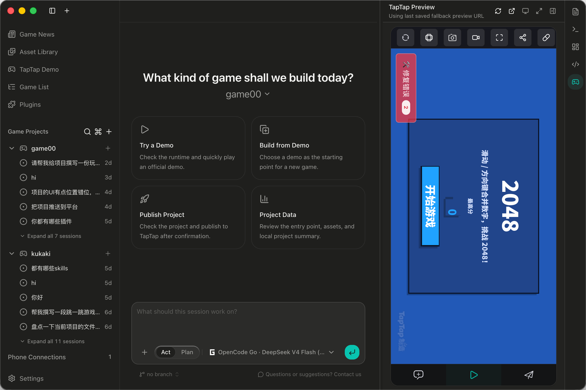
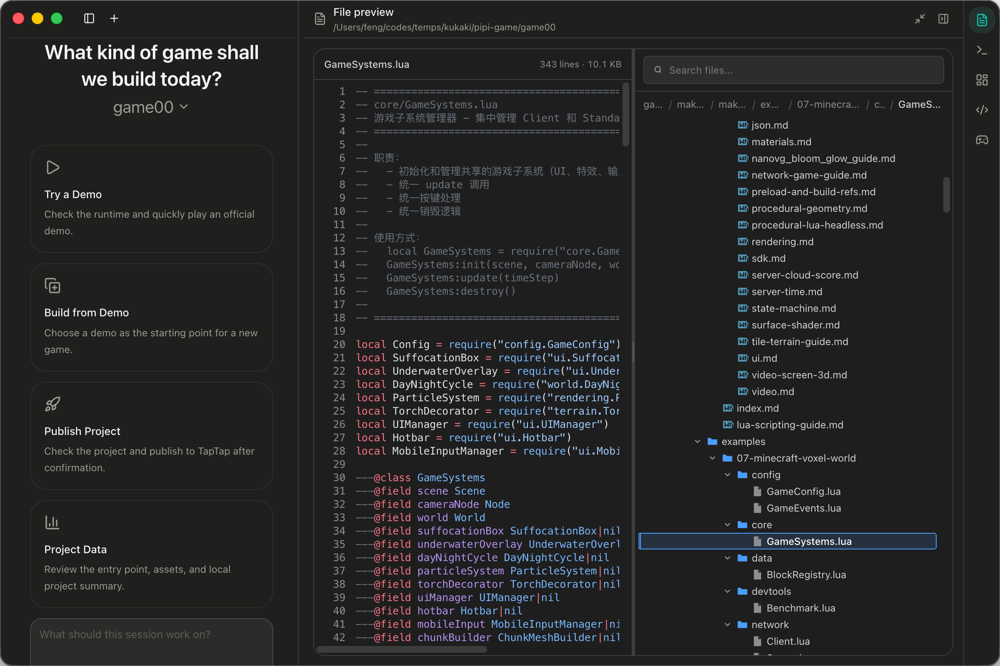
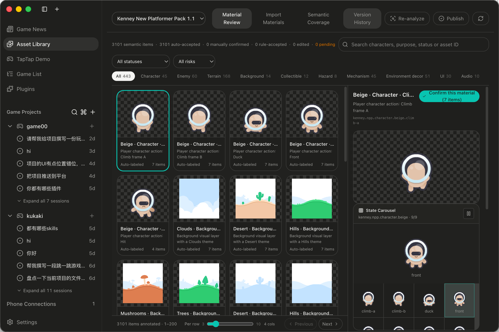

# KayingCodex

[English](README.md) | [简体中文](README.zh-CN.md) | [日本語](README.ja.md) | [한국어](README.ko.md)

---

**게임 개발을 위해 만들어진 지능형 에이전트 워크벤치 ―― AI가 "컴파일은 되는 것처럼 보이는 코드"만 작성하는 것이 아니라, 진짜 게임을 완성하도록.**

[](LICENSE)

> 데스크톱 버전: **1.5.0** · 기본 작업 모드: **게임 개발**

---

## 스크린샷

<table>
<tr>
<td width="50%">

**① AI 워크스페이스 — 홈**

자연어로 게임을 설명하면 워크벤치가 계획을 세우고 플레이 가능한 프로토타입을 단계적으로 구현합니다.



</td>
<td width="50%">

**② 도구 패널**

즐겨찾기 도구 — 환경 확인, 인증 받기, 프로젝트 초기화, TapTap 제출을 원클릭으로 실행.



</td>
</tr>
<tr>
<td width="50%">

**③ 라이브 TapTap 미리보기**

앱 안에서 실시간 미리보기 — 오른쪽 TapTap Preview에서 2048 데모가 실행 중.



</td>
<td width="50%">

**④ 파일 미리보기 & 지식 베이스**

Lua 소스(예: `GameSystems.lua`)와 버전 관리된 오프라인 API 문서를 한눈에 확인.



</td>
</tr>
<tr>
<td colspan="2" align="center">

**⑤ 에셋 라이브러리**

3101개의 시맨틱 주석, 카테고리 필터, 자동 승인 / 수동 확인 워크플로우와 상태 캐러셀.



</td>
</tr>
</table>

---

## 이것은 무엇인가?

KayingCodex는 게임 크리에이터를 위한 데스크톱 애플리케이션입니다. 강력한 AI 에이전트와 "품질 보증 프레임워크"를 결합했습니다. "횡스크롤 점프 게임을 만들어 줘"라고 요청하면, 몇 개의 파일만 수정하고 "완료"라고 보고하는 것이 아니라, **디자인 → 씬 → 게임플레이 → 통합 → 테스트**의 전체 파이프라인을 따라 한 단계씩 실제로 작동하는 것을 만들어 냅니다.

일반적인 AI 코딩 도구는 프로젝트를 텍스트 저장소로 취급하지만, 게임은 **씬, 애셋, 바인딩, 게임플레이 로직**이 얽힌 그래프입니다. KayingCodex의 핵심적인 차이점:

- **컴파일됨 ≠ 플레이 가능**: 애셋이 실제로 바인딩되었는지, 플레이어가 실제로 화면을 볼 수 있는지 검증합니다. 타입 체크만 통과하는 것이 아닙니다.
- **선언됨 ≠ 적용됨**: 텍스처를 참조했다고 해서 그 텍스처가 실제로 게임에 퍼블리시된 것은 아닙니다. 프레임워크는 "증거"가 있어야 인정합니다.
- **장기 작업도 흐름을 잃지 않음**: 하나의 게임은 여러 단계에 걸쳐 진행됩니다. KayingCodex는 각 단계를 영구 저장된 작업 진행 상황으로 기록하므로, 앱을 닫았다가 다시 열어도 중단한 지점부터 재개할 수 있습니다.
- **자체 보고된 성공으로는 통과 불가**: AI가 "완료했다"고 말하는 것만으로는 부족합니다. 디스크에 검증 가능한 증거가 실제로 존재해야 품질 게이트가 열립니다.

한마디로: **판단력은 AI에게, 기억·제약·검수는 워크벤치에게.**

---

## 핵심 기능

### 1. 완전한 게임 개발 파이프라인

KayingCodex는 게임 프로젝트를 명확한 단계로 나누고, 자동으로 진행·기록·검수합니다:

```
요구사항 → 발견 → 역량 감사 → 계획 → 계약 동결
     → 씬 계획 → 씬 구축 → 씬 게이트
     → 게임플레이 계획 → 게임플레이 구축 → 통합 게이트
     → 테스트 → 의사결정 → 릴리스 → 완료
```

각 단계에는 명확한 산출물과 검수 기준이 있습니다. 언제든 현재 진행 상황을 확인하고 "지금 어디까지 왔고, 다음에 무엇을 해야 하는지" 알 수 있습니다.

### 2. 실제로 반영되는 애셋

게임 개발에서 가장 많이 겪는 문제가 바로 "아트가 바인딩되지 않은" 경우입니다. KayingCodex는 **시맨틱 애셋 레이어**를 내장하여 애셋을 검토 가능하고 퍼블리시 가능한 패키지로 관리합니다: 발견, 가져오기, 주석 달기부터 씬에 바인딩, 검증, 퍼블리시까지 모든 단계가 기록됩니다. 어떤 애셋이 실제로 게임에 바인딩되었고 어떤 것이 "선언만 된 것"인지 명확하게 알려줍니다.

### 3. 역할 분담 협업

워크벤치 내부에서는 4명의 전문 "역할"이 릴레이 방식으로 작업을 수행합니다:

| 역할 | 담당 |
|---|---|
| **게임 디렉터** | 요구사항 및 검수 기준, 전체 계획, 주요 의사결정 |
| **씬 빌더** | 씬, 인터페이스, UI, 애셋 바인딩 |
| **게임플레이 엔지니어** | 게임플레이 로직, 모듈, 상태 머신 |
| **품질 테스터** | 검수 점수 평가, 디렉터에게 문제 피드백 |

작업은 배턴 터치처럼 역할 간에 전달되며, 인계가 명확합니다. "작업 중에 누가 무엇을 담당하는지 모르겠다"는 일이 없습니다.

### 4. 내장 지식 베이스 (오프라인 지원)

AI가 엔진 API 사용법을 추측하게 할 필요가 없습니다. KayingCodex에는 버전 관리된 검증된 API 지식 베이스(26개 도메인, 166개 오퍼레이션 커버)가 내장되어 있어 완전히 오프라인에서도 사용할 수 있으며, 생성된 코드가 확실하고 올바른 사용법을 따르도록 보장합니다.

### 5. 두 가지 실행 방식

| | **LocalRuntime (로컬 실행)** | **TapTap Runtime (공식)** |
|---|---|---|
| 개요 | 앱 내장 크로스플랫폼 Lua UI 러너 | TapTap 공식 로컬 러너 |
| 플랫폼 | 크로스플랫폼 (macOS / Windows / Linux) | Windows 전용 |
| 용도 | 대화형 디자인 미리보기, 로컬 즉시 미리보기 | TapTap 플랫폼 빌드 및 릴리스 연동 |

LocalRuntime을 통해 네트워크나 외부 도구 없이도 앱 안에서 씬의 실제 렌더링 결과를 직접 확인할 수 있습니다.

---

## 무엇을 할 수 있나요?

- **처음부터 게임 만들기**: 아이디어를 설명하면 워크벤치가 계획을 세우고 플레이 가능한 게임 프로토타입을 단계적으로 구현합니다.
- **비주얼 디자인 캔버스**: 디자인 탭에서 씬과 UI를 직접 미리보고 조정할 수 있습니다. WYSIWYG 방식입니다.
- **애셋 라이브러리 관리**: 아트 및 오디오 애셋을 가져오고, 주석을 달고, 바인딩하여 실제로 게임에 포함되도록 합니다.
- **TapTap에 출시**: 내장 흐름을 통해 출시 준비 상태를 검증하고 빌드를 제출합니다.

---

## 빠른 시작

### 설치

릴리스 페이지에서 사용 중인 플랫폼(macOS / Windows / Linux)용 설치 파일을 다운로드하여 설치 후 실행하세요. 앱은 기본적으로 게임 개발 모드로 시작합니다.

### 처음 사용하기

1. KayingCodex를 실행하여 게임 개발 워크스페이스에 들어갑니다.
2. 새 프로젝트를 생성하거나 기존 프로젝트를 엽니다.
3. 만들고 싶은 게임을 자연어로 설명합니다 (예: "2D 횡스크롤 점프 게임을 만들어 줘. 주인공은 사각형 블록이고 점프와 코인 획득이 가능해야 해").
4. 워크벤치는 파이프라인을 따라 진행합니다: 먼저 요구사항을 확인하고, 씬과 게임플레이를 계획하며, 단계별로 구축하고 검수합니다.
5. 디자인 캔버스에서 실시간으로 결과를 미리보고, 문제가 없으면 출시합니다.

### 주요 진입점

- **디자인 탭**: 로컬 런타임의 씬과 UI를 대화형으로 미리보기.
- **애셋 라이브러리**: 프로젝트 애셋 조회, 가져오기, 바인딩.
- **출시 패널**: 출시 준비 상태 검증 및 TapTap 제출.
- **사이드바 "실행" 탭** (Windows): TapTap Runtime으로 실행.

---

## 시스템 요구 사항

- **LocalRuntime (로컬 미리보기)**: macOS / Windows / Linux 모두 지원.
- **TapTap Runtime (공식 실행 / 출시)**: Windows 환경 필요.
- 런타임 및 애셋 리소스 다운로드와 업데이트를 위해 네트워크 연결 필요.

---

## 자주 묻는 질문

**Q: 일반 AI 코딩 어시스턴트와 무엇이 다른가요?**
일반 어시스턴트는 파일 수정을 마치면 "성공"이라 선언하지만, 게임이 실제로 실행되는지 아트가 바인딩되었는지는 검증하지 않습니다. KayingCodex는 영구 저장된 작업 흐름과 증거 기반 품질 게이트를 통해 모든 단계가 확실하게 완료되도록 보장합니다.

**Q: 프로젝트 파일은 어디에 저장되나요?**
게임 프로젝트 내부의 작업 진행 상황과 증거는 프로젝트 디렉터리 아래 `.project/`에 저장되어 프로젝트와 함께 이동하므로 협업과 백업이 쉽습니다. 앱 자체의 설정과 로그는 사용자 디렉터리의 `~/.KayingCodex/`에 저장됩니다.

**Q: 인터넷 연결이 필요한가요?**
지식 베이스와 로컬 미리보기는 완전히 오프라인에서 사용할 수 있습니다. TapTap 플랫폼 빌드 및 출시 연동 시에는 인터넷 연결이 필요합니다.

**Q: 어떤 플랫폼을 지원하나요?**
로컬 개발과 미리보기는 크로스플랫폼을 지원합니다. TapTap 공식 실행 및 출시는 현재 Windows만 지원합니다.

---

## 라이선스

[MIT](LICENSE) © Kaying Studio.
