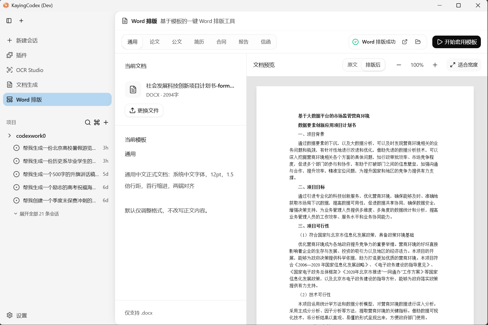
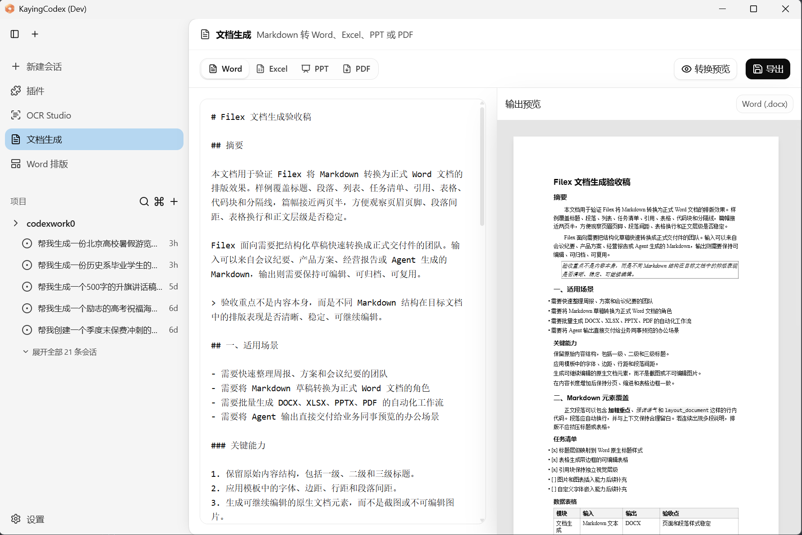
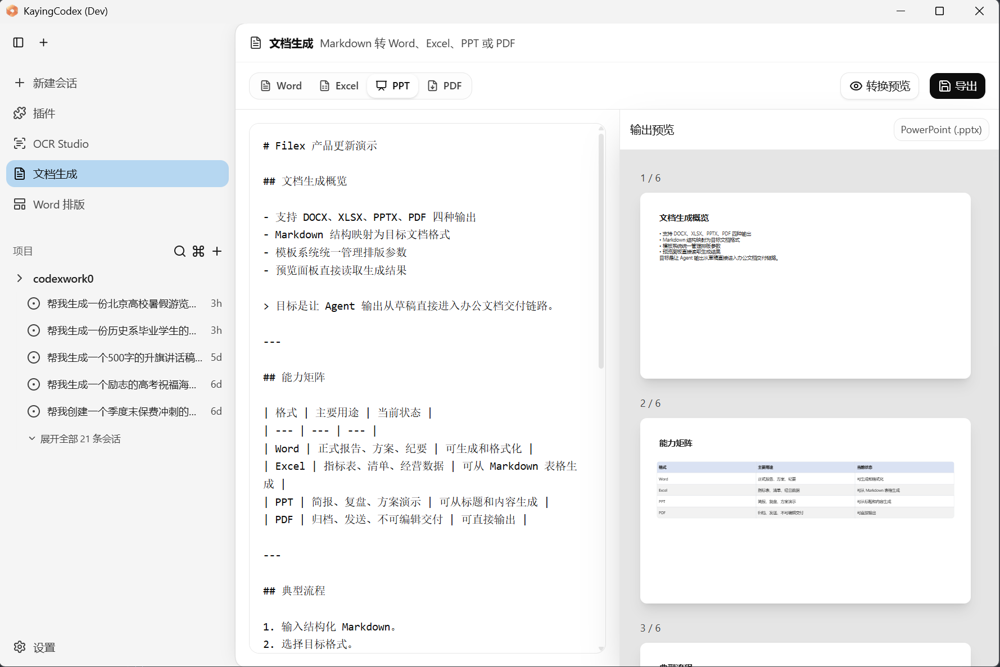
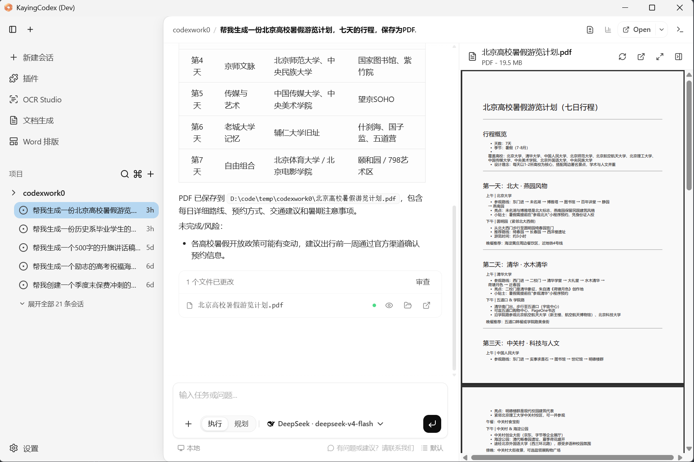

# 咖影AI (KayingAI)

**咖影AI（KayingAI）打造 KayingCodex AI 桌面工作台，支持一句目标生成文档、拍照仿写与修改、Markdown 离线转 Word、PPT、Excel、PDF。**

---

## 核心产品

   
   
   
   

### KayingCodex — AI 办公交付桌面工作台

KayingCodex 的价值不是多一个聊天框，而是把常见办公交付动作放进一个桌面工作流里。

- **一句目标生成成稿** — 不用从空白页开始。告诉它你要写教案、会议纪要、客户方案还是复习计划，先得到一版可改的结构化初稿。
- **拍照仿写 / 修改 / 直出** — 拍一张通知、作业、表格或客户材料，让 KayingCodex 按样式仿写、改写原内容，或整理成正式文件。
- **多格式交付** — 同一份内容可以按用途导出为 Word、PPT、Excel、PDF，适合教案、课件、汇报、表格和固定版式材料。
- **Markdown 离线转 Office** — 已有 Markdown 时，不需要 AI、不消耗 token，离线即可生成 Office 文档，适合批量排版和正式交付。

---

## 角色场景

| 角色 | 目标 | 输入 | 输出 |
|------|------|------|------|
| **小学教师** | 把课程主题变成教案、课件和练习 | 输入"做一份三年级语文《荷花》公开课课件和教案"，或拍下旧教案要求仿写 | Word 教案、PPT 课件、课堂练习、家长通知 |
| **小学家长** | 把孩子薄弱点变成可执行辅导计划 | 拍下错题或输入"孩子四年级，分数应用题总错，帮我安排一周复习" | 错题讲解、同类练习、每日安排、家长讲解提纲 |
| **公务/事业单位人员** | 把零散材料整理成正式机关文档 | 粘贴会议记录、调研要点，或拍下纸质通知和表格 | 会议纪要、工作汇报、通知、调研报告、PDF 定稿 |
| **保险代理人** | 把客户情况变成清楚的沟通材料 | 输入客户家庭结构、预算、关注点，或拍下现有保障信息 | 保障方案、产品对比表、沟通话术、回访记录 |
| **行政培训人员** | 把培训主题变成一套执行材料 | 输入培训对象、主题、时间安排和组织要求 | 培训通知、签到表、培训 PPT、总结报告 |
| **方案交付人员** | 把 Markdown 方案快速变成交付物 | 粘贴已经写好的 Markdown 方案、报价说明或项目总结 | 离线导出 Word、PPT、PDF，表格内容可生成 Excel |

---

## 拍照处理

把照片里的格式、文字和信息变成下一份能交付的材料：

1. **拍一张通知** — 按原有格式仿写新通知，替换时间、对象和事项
2. **拍一页作业** — 整理知识点、生成讲解步骤和同类练习
3. **拍一份客户资料** — 提炼关键信息，生成回访记录或方案初稿
4. **拍一张表格** — 整理字段、补齐说明，再输出为 Excel 或 Word

---

## 离线转换

当内容已经写好，KayingCodex 会使用内置本地转换引擎生成 Office 文件。转换过程不调用 AI 模型，不消耗 token，断网也可以完成。

- Markdown 转 Word
- Markdown 转 PPT
- Markdown 表格转 Excel
- Markdown 转 PDF

---

## 工作流

1. **说出目标** — "做一份家长会 PPT"、"把会议记录整理成纪要"
2. **投入材料** — 粘贴文字、拍照上传、放入 Markdown
3. **生成与修改** — 让 AI 先产出结构，再继续改口吻、补内容
4. **预览并导出** — 按场景导出 Word、PPT、Excel 或 PDF

---

## 联系我们

- 邮箱：service@kayingai.com
- 代码仓库：[GitCode](https://gitcode.com/kayingai/kaying-codex)
- 微信：扫描左侧二维码获取 1 对 1 技术支持

---

*Copyright © 2026 北京零点八度科技有限公司. All Rights Reserved.*